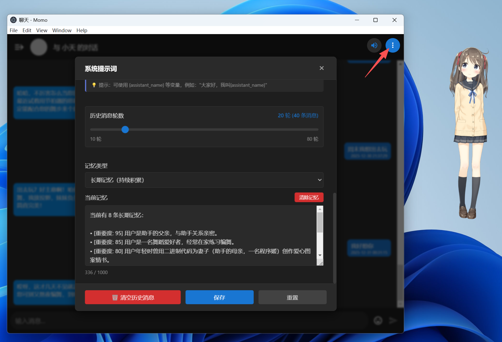
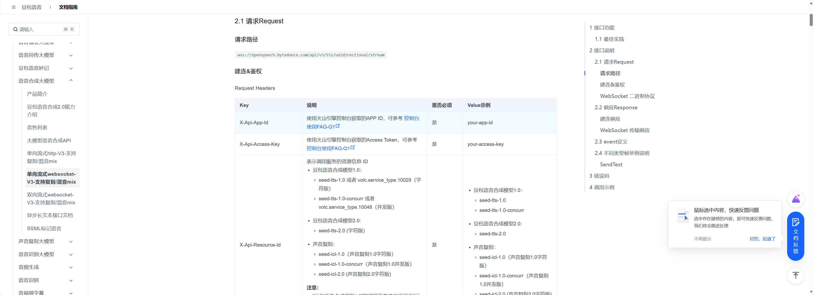
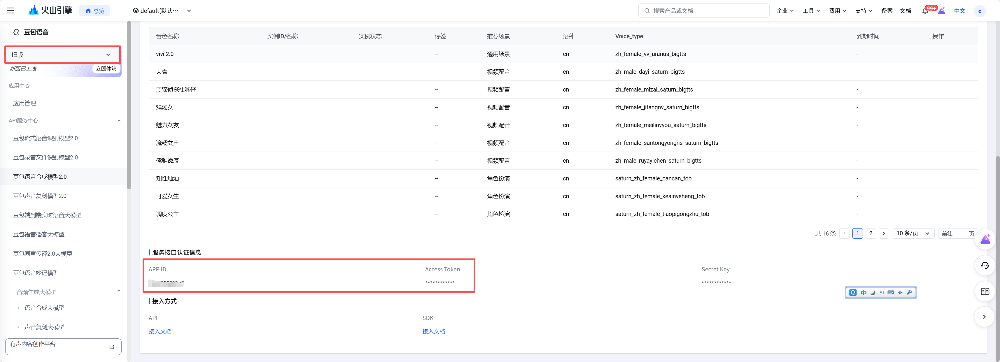
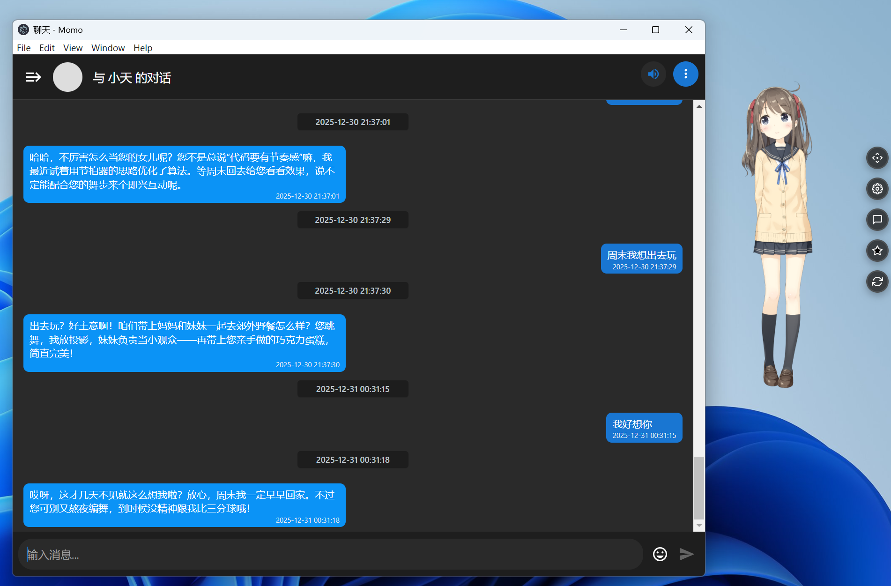
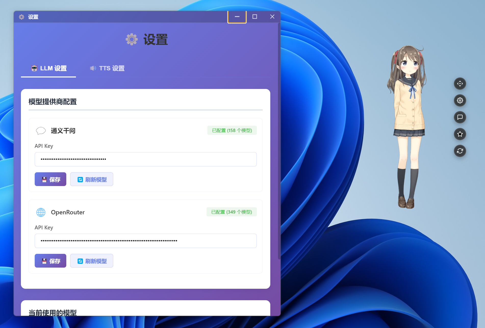

## 一、GitHub README（中文草案）

# Momo AI 桌面宠物（Demo）

一个运行在桌面的 Live2D 数字宠物，内置 AI 聊天、语音合成和长期记忆能力。  
它可以记住你、陪你聊天、用喜欢的声音跟你说话，并在屏幕一角安静地待着。

---

## ✨ 项目介绍

**Momo AI 桌宠是什么？**

- 一款基于 Electron + Live2D 的桌面数字人 / 桌宠应用
- 支持 **文字聊天 + 语音合成 + Live2D 口型同步 + 长期记忆**
- 使用本地 SQLite 存储长期记忆，重启后依然“记得你”

**可以做什么？**

- 像跟朋友一样聊天（支持多种 LLM，按你配置）
- 在桌面上展示一个有动作和表情的 Live2D 角色
- 用语音和它对话，嘴巴会跟着你的声音和 AI 的声音动
- 记住你的偏好、职业、关系等长期信息，并在之后的对话里自然地体现出来

> 当前仓库为 **开源 Demo / MVP 版本**，持续开发中，欢迎一起折腾。

---

## ✅ 功能列表

### 已实现的功能

- **桌宠展示**
  - Live2D 模型渲染（支持多模型、多动作、多表情）
  - 桌面悬浮窗口，可拖动、记住位置

- **AI 文本对话**
  - 使用 OpenAI 兼容接口（如 DeepSeek、通义等）
  - 可配置系统提示词 / 人设（如女友、宠物、助理等）
  - 对话历史本地存储，可控制携带轮数

- **长期记忆（本地）**
  - 使用 SQLite 持久化长期记忆
  - 每固定轮数对话后（默认每 10 轮）自动触发“阶段性总结”
  - 将「历史记忆 + 最近对话」一起交给 LLM **重新整理**，自动更新/纠正旧记忆  
    （例如：之前记了“得了绝症”，后来你说“开玩笑的没病”，新总结会修正）
  - 记忆按类别管理：fact / preference / relationship / project / event
  - 在生成回复时自动注入相关记忆（带长度控制与压缩）



- **语音合成 & 口型同步**
  - 集成火山引擎 TTS（豆包 TTS）进行语音合成
  - 文本 → TTS 合成 → 音频播放
  - 音频音量分析 → 映射到 Live2D `ParamMouthOpenY` → 嘴巴随声音自然开合

- **基础设置与配置**
  - 设置历史消息轮数、长期记忆注入长度上限等
  - 本地保存 LLM/TTS 的配置（接口地址、模型名、API Key 等）

---

### 进行中的功能

- **音色 / 声线预设**
  - 支持切换不同 TTS 音色（如豆包 O 版音色、克隆音色等）
  - 正在完善「角色人格 + 音色」的预设体系（如：元气少女、治愈男友、工作助理等）

- **长期记忆体验打磨**
  - 更友好的 UI 展示记忆内容
  - 更稳定的记忆总结与注入策略

---

### 计划中的功能

- **高级长期记忆管理**
  - 记忆搜索 / 筛选
  - UI 中查看 / 编辑 / 删除单条记忆
  - 多维度权重与“时间衰减”策略

- **更多 Live2D 模型与动作包**
  - 官方授权/自制角色扩展包
  - 不同情绪 / 场景动作集合（早安、晚安、鼓励、打气等）

- **音色 & 人设 Pro 预设包**
  - 针对不同场景的角色预设（学习陪伴、写代码陪伴、情绪支持等）
  - 一键切换"人格 + 说话风格 + 音色"

- **云同步与多设备**
  - 长期记忆云同步
  - 多设备共享同一个“宠物人格”

---

## 🖼 Demo 截图（占位说明）

> 建议在此处放 3–4 张截图（可后续补上）：

1. **桌宠主界面**：Live2D 模型站在桌面右下角 + 控制按钮
2. **聊天窗口**：文本对话 + 当前长期记忆展示区域
3. **语音合成状态**：AI 回复语音播放、Live2D 嘴巴随声音开合
4. **设置页**：LLM / TTS / 记忆相关配置界面

示例占位：

```markdown


```

---

## 🔧 核心技术栈

- **桌面应用**：Electron 28 + Node.js ≥ 18
- **前端 & 渲染**：Vite 5、TypeScript、PixiJS 7、Live2D Cubism JS SDK
- **AI 能力**：
  - LLM：OpenAI 兼容接口（如 DeepSeek / 通义等）
  - 语音：
    - 火山引擎 TTS（豆包 TTS）
- **数据存储**：本地 SQLite（长期记忆）、localStorage（前端配置）

---

## 🚀 使用方法

### 环境要求

- Node.js ≥ 18
- 推荐操作系统：Windows / macOS（开发主要在 Windows 上验证）
- 需要可以访问：
  - 你的 LLM 服务（OpenAI 兼容）
  - 火山引擎 TTS / 其它 TTS 服务（如需使用语音功能）

### 安装与运行

```bash
# 1. 克隆仓库
git clone https://github.com/a237821375/momo-desktop-pet.git
cd momo

# 2. 安装依赖
cd apps/desktop
npm install

# 3. 启动开发版
npm run dev
```

执行完成后会自动打开 Electron 窗口，桌宠出现在桌面上。

---

## ⚙️ API Key 与配置说明

- **LLM（必需）**
  - 需要自行准备 OpenAI 兼容的 API Key（如 DeepSeek、通义等）
  - 在应用设置中填入：
    - 接口地址（Base URL）
    - 模型名称（model）
    - API Key

- **语音 / TTS（可选但推荐）**
  - 火山引擎 TTS：
    - 需要配置 App ID、Access Token 等
    - 在设置页或配置文件中填写
    https://www.volcengine.com/docs/6561/1719100?lang=zh



> 出于安全考虑，**本项目不会帮你内置任何真实密钥**，所有 Key 都需要你在本地手动配置。

---

## ⭐ Star & 社区

- 如果你觉得这个项目还不错，**欢迎点一个 Star**，这是对我们继续维护的最大鼓励 🙌
- 有任何问题 / 建议：
  - 可以直接提交 GitHub Issue
  - 或在 Discussions 中交流
- 如果你有兴趣一起共建：
  - 欢迎提 PR，或者在 Issue 里说明你想做的方向（模型、音色等）

---

## 📄 License

- 本仓库默认采用 **MIT License** 开源
- 你可以在此基础上二次开发、个人使用或内部使用  
  （如需商用或对接自有资产，请留意你使用的 Live2D 模型与 TTS 服务的授权协议）

> 具体以仓库中的 `LICENSE` 文件为准。

---

## 🆓 Free 版 vs Pro 版（规划）

> 当前仓库即为 **Free / 开源 Demo 版**，Pro 版仍在规划与开发中。

| 功能项                       | 免费版（当前仓库）                             | Pro 版（规划中）                                   |
------------------------------|-----------------------------------------------|---------------------------------------------------|
| Live2D 桌宠显示              | ✅ 基础 Live2D 显示 + 动作                     | ✅ 更多官方/自制模型与动作包                       |
| AI 文本对话                  | ✅ 自行配置 LLM                               | ✅ 内置多种角色预设与场景优化                      |
| 长期记忆（本地）             | ✅ SQLite 本地存储 + 阶段性总结               | ✅ 高级记忆管理（搜索/编辑/时间衰减/云同步）       |
| 语音合成 & 口型同步          | ✅ 火山引擎 TTS 集成                        | ✅ 更多语音服务支持 + 实时语音对话                |
| 音色 / 人设预设              | 🔄 基础配置，开发中                           | ✅ 完整音色包 + 人设组合，一键切换                 |
| Live2D 表情 / 动作触发       | ❌ 暂不支持                                   | ✅ AI 自动触发表情动作（开心/难过/思考等）         |
| MCP 电脑控制                 | ❌ 无                                         | ✅ 安全沙箱下的应用启动 / 文件管理（实验性）       |
| 自动更新                     | ❌ 暂不提供                                   | ✅ 内置自动更新 / 版本管理                         |
| 云端同步与多设备             | ❌ 无                                         | ✅ 记忆与设置云同步，多设备共享同一"宠物人格"      |
| 商业用途支持                 | ✅ MIT 授权，需自行处理模型/音源授权          | ✅ 提供打包方案与商业授权选项                      |

> 表格为规划方向，Pro 版功能会**逐步迭代上线**，不保证一次性全部到位。


---

## 二、一句话项目 Slogan（3–5 条候选）

- **“会记住你的 AI 桌宠。”**
- **“不只是聊天窗口，是待在你桌面上的数字同伴。”**
- **“会说话、会记忆、会撒娇的 Live2D 桌面宠物。”**
- **“把 AI 装进桌面角落，让它天天陪着你。”**
- **“一只会越聊越懂你的桌宠。”**

---

## 三、Demo 版本定位描述

- **版本定位**
  - 当前版本为 **Demo / MVP / Preview** 阶段
  - 主要目标：验证「Live2D 桌宠 + AI 对话 + 语音 + 长期记忆」的整体体验闭环

- **稳定性与体验提示**
  - 功能已可用，但：
    - 对外部服务（LLM / 豆包等）网络依赖较强
    - 部分异常情况下（Key 配置错误、服务限流）可能需要查看控制台日志排查
  - 长期记忆策略已支持纠正/更新旧记忆，但依然处于持续打磨阶段

- **适合公开演示的能力**
  - Live2D 桌宠展示与基础互动
  - 与 AI 的文字聊天（包括自定义人设）
  - 语音合成 + 口型同步效果
  - 基础长期记忆效果：在数轮对话后，能记住你的职业 / 爱好 / 关系等，并自然体现在后续回复中

---

## 四、Pro 版功能规划（开发中）

- **高级长期记忆管理**
  - UI 中查看所有记忆（按时间 / 权重 / 分类筛选）
  - 支持手动删除 / 编辑单条记忆
  - 记忆时间衰减策略（久远信息自动降低权重）
  - 云同步与多设备共享记忆（Pro 版核心卖点之一）

- **更多 Live2D 模型与动作包**
  - 官方授权 / 自制 Live2D 模型合集
  - 不同场景的动作包（早安、晚安、工作、学习、发呆……）
  - 动作脚本化：随心配置日常行为与随机事件

- **语音音色预设与角色人格预设**
  - 针对不同人设打包：Prompt + 说话风格 + TTS 音色
  - 一键切换「角色档案」（如：程序员同事、学习陪伴、恋爱向等）
  - 可能提供付费音色包 / 声线主题包

- **自动更新与云服务**
  - 应用自动更新（检查新版本、提示安装）
  - 云端服务：
    - 记忆/设置云备份
    - 多设备同步
    - 可能的在线商城（模型、音色、角色预设等）

- **面向创作者的“内容包”**
  - 提供「模型 + 动作 + 人设 + 音色」的一体化打包方案
  - 支持创作者以 Pro 版为基础制作自己的“角色包”，再进行付费分发

---

模型推荐：DeepSeek3.2

语音推荐：湾湾小何 v1.0


当前效果




---

开源版：在此仓库

Pro 版：包含高级功能

付费/合作请联系我
